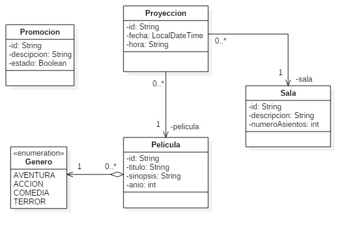

# APAW EFP1 Arquitecturas y Patrones Web
#### Asignatura: *Arquitecturas y Patrones Web*
#### [Máster en Ingeniería Web por la U.P.M.](http://miw.etsisi.upm.es)

## Tecnologías necesarias
* Java
* Maven
* GitHub

## Patrones utilizados

* Factory
* Singleton
* Builder
* Composite
* Observer
* Strategy

### Descripción

Para este proyecto se utiliza un diagrama de base de datos relacional para la gestión de un
multicines el mismo que luego se utilizará para aplicar diferentes patrones de arquitecturas web
sobre cada una de las clases.

## Diseño de entidades

##### Autor: Dennys Xavier Landy